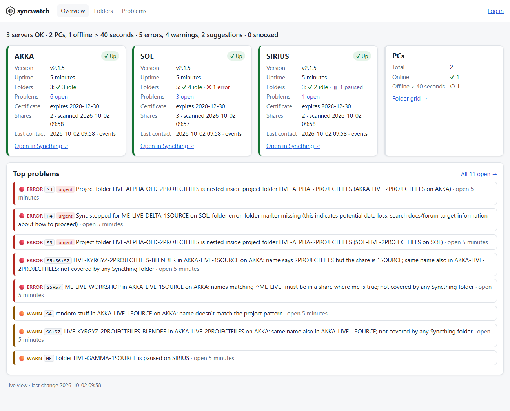

# syncwatch

[](https://github.com/ivarstudios/syncwatch/actions/workflows/ci.yml)

A small, **read-only** monitor for [Syncthing](https://syncthing.net) deployments with a few always-on servers (NASes) and many PCs. It gives you:

- a **live dashboard**: server tiles, a device × folder sync grid and a problems list (phone-friendly, updates live);
- a **weekly report** in Discord;
- **urgent pings** in Discord when something big breaks: a server or server link down, a folder that stopped syncing, overlapping Syncthing folders, nested project folders.

syncwatch **never changes Syncthing**. It reads each server's REST API with a typed client that can only send `GET` requests to an allowlist of endpoints, so it needs no SMB mounts, no filesystem access and no software on the PCs.



**Status:** pre-release. No version is tagged yet, so the image and binaries named below appear with the first release; until then, [build it yourself](#build-it-yourself). Syncthing 2.x only.

## Contents

- [Install](#install) · [First start](#first-start) · [Configuration](#configuration) · [Checks](#checks) · [Notifications](#notifications)
- [Security](#security) · [JSON status API](#json-status-api) · [Home Assistant](#home-assistant) · [Probe your servers](#probe-your-servers-first) · [Development](#development) · [Limitations](#known-limitations)

## Install

syncwatch ships as a multi-arch Docker image (`linux/amd64`, `linux/arm64`): `ghcr.io/ivarstudios/syncwatch`.

```yaml
services:
  syncwatch:
    image: ghcr.io/ivarstudios/syncwatch:1.0.0   # pin the digest too, see Updating
    container_name: syncwatch
    restart: unless-stopped
    user: "65534:65534"          # any non-root user that owns ./data
    read_only: true
    tmpfs: [/tmp]
    cap_drop: [ALL]
    security_opt: ["no-new-privileges:true"]
    environment:
      - TZ=Europe/Stockholm
      - SYNCWATCH_TLS_HOSTS=192.168.1.10   # the address you open, for the HTTPS certificate
    ports:
      - "192.168.1.10:8080:8080"  # LAN address only
    volumes:
      - ./data:/data
```

```sh
mkdir data && sudo chown 65534:65534 data   # match the user: line
docker compose up -d
docker logs syncwatch                       # shows the one-time setup token
```

The image runs as a non-root user with a read-only root filesystem; everything it writes goes to `/data` (an SQLite database, `secret.key`, and with self-signed HTTPS its certificate). Back up `/data`, and keep it out of any share other people can read: `secret.key` decrypts the stored API keys. If you lose `secret.key` (or change `SYNCWATCH_SECRET_KEY`), the stored API keys and webhook can't be decrypted and must be entered again.

A single static binary works too (`syncwatch serve --data ./data`), including on Windows. See the [releases](https://github.com/ivarstudios/syncwatch/releases). The binary listens on `127.0.0.1:8080` unless you pass `--listen 192.168.1.10:8080` (or set `SYNCWATCH_LISTEN`); the image listens on `:8080` inside the container, so the address in `ports:` decides who can reach it. Always give that address: a bare `-p 8080:8080` publishes on every interface of the host.

**Don't expose syncwatch to the internet.** Reach it over your LAN, a VPN or a reverse proxy with its own authentication.

### Build it yourself

```sh
git clone https://github.com/ivarstudios/syncwatch && cd syncwatch
docker build -t syncwatch:dev .                 # the image: use image: syncwatch:dev above
go build -o syncwatch ./cmd/syncwatch           # or the binary (Go 1.27 or later)
```

The image builds for `linux/amd64` and `linux/arm64` (`docker buildx build --platform …`); the binary cross-compiles with `GOOS`/`GOARCH` and `CGO_ENABLED=0`.

### Where to run it

syncwatch can't report the machine it runs on going down: if that machine is one of the monitored servers and it loses power or hangs, its "server unreachable" ping (H1) is never sent. So either:

- run syncwatch on a host it doesn't monitor (another NAS, a small always-on machine) that can reach every Syncthing GUI, or
- if it runs on a monitored server, add an outside check of `https://<host>:8080/healthz` that alerts on its own (Uptime Kuma, healthchecks.io, Home Assistant, your router's monitoring).

Without either, the missing Monday report is the only sign that syncwatch or its host is gone.

### HTTPS

The image serves HTTPS by default, so the password and session cookie never cross the LAN in plain text. It makes a self-signed certificate in `/data`, renews it before it expires and logs its fingerprint; each browser asks once to trust it. The certificate covers `localhost`, the host of `public_url`, a specific listen address and the names in `SYNCWATCH_TLS_HOSTS` (comma-separated; set it to the address you open, since the container only sees `:8080`). When those change, the next start makes a new certificate and browsers ask again.

- Your own certificate: `SYNCWATCH_TLS_CERT` and `SYNCWATCH_TLS_KEY` (they win over the self-signed one).
- Plain HTTP: `SYNCWATCH_TLS_SELF_SIGNED=false`.
- The plain binary serves HTTP unless you set one of the above (it listens on loopback by default).

Cookies are marked `Secure` over HTTPS, and `syncwatch healthcheck` follows along.

### Updating

syncwatch holds API keys that can change anything in your Syncthing, so update deliberately rather than automatically. Pin the image by digest, so a tag that moves can't change what runs:

```sh
docker buildx imagetools inspect ghcr.io/ivarstudios/syncwatch:1.0.1   # shows "Digest: sha256:…"
```

```yaml
    image: ghcr.io/ivarstudios/syncwatch:1.0.1@sha256:<digest>
```

Read the release notes, change the line, then `docker compose up -d`. Keep auto-updaters such as Watchtower off for this container.

## First start

1. Open `https://<host>:8080` (`http://` if you turned [HTTPS](#https) off) and accept the self-signed certificate once. With no admin password yet, you're sent to **Set up**: enter the **setup token** printed in the log (`docker logs syncwatch`) and choose the admin password. The token proves you can read the server's log, so the first visitor on the LAN can't claim the admin account. (Alternatively set `SYNCWATCH_ADMIN_PASSWORD` for the first start.)
2. Under **Settings → Servers**, add each Syncthing instance that syncwatch should poll: a name, the GUI/API URL (e.g. `https://192.168.1.10:8384`) and its API key (Syncthing → Actions → Settings → API Key). Self-signed Syncthing certificates are trusted on first use and pinned. An API key is only ever sent to the URL it was entered for: changing a server's URL means entering its key again.
3. Under **Settings → Notifications**, paste a Discord webhook URL (Channel → Integrations → Webhooks) and the numeric ID of the role to mention in urgent messages. Use **Send a test message** to check it.
4. Optionally paste naming rules under **Settings → Structure** (see [examples/ivar.yaml](examples/ivar.yaml)).

Each polled Syncthing GUI must be reachable from the syncwatch host. PCs don't need to be reachable: syncwatch sees them through the servers.

### Bootstrap file

Instead of clicking through the settings, put a YAML file at `/data/syncwatch.yaml` (or point `SYNCWATCH_CONFIG` at one) before the first start. It is imported **once**, when the database has no configuration yet, including any `api_key`, `discord_webhook` and `api.token` it contains, which are then stored encrypted and **removed from the file** (the rest of it, comments included, stays). If the file can't be rewritten (a read-only mount), the log says so on every start until you delete it. Later changes happen in the UI, or with **Settings → Export and import** / `syncwatch import-config FILE` (delete that file afterwards if it contained secrets). Exports never contain secrets.

## Configuration

Everything can be set on the settings page. The YAML format (export/import) looks like this; every key is optional except the servers:

```yaml
public_url: https://192.168.1.10:8080  # dashboard links in Discord messages
timezone: Europe/Stockholm
servers:
  - name: AKKA
    url: https://192.168.1.10:8384
    gui_url: https://akka.lan:8384       # optional: where "Open in Syncthing" links point
    api_key: …                           # import only; never exported; bound to this url
    # allow_http: true                   # needed for a plain http:// url (sends the key unencrypted)
collector:
  mode: events              # events (live) or polled (lighter: full re-check every poll_interval)
  event_timeout: 50s        # long-poll timeout; keep it below any VPN idle timeout
  full_check_interval: 4h   # full re-check in events mode (also on start and reconnect)
  poll_interval: 15m        # polled mode
  structure_interval: 1h    # top-level structure scan
  baseline_interval: 7d     # depth scan inside synced folders (events cover them in between)
  concurrency: 3            # requests at once per server
  request_timeout: 30s
  down_after_failures: 2
checks:                     # per-check overrides
  H7: { urgent: true, debounce: 1h }
  S7: { enabled: false }
thresholds:
  failing_files: 1h         # H4 when failing files are the only problem
  stuck_sync: 24h           # H5
  paused: 3d                # H6
  pc_offline: 7d            # H7
  conflict_window: 7d       # H10
  inactive_project: 180d    # C1
  old_device: 90d           # C2
  dead_share: 30d           # C3
notifications:
  discord_webhook: …        # import only
  discord_role_id: "123456789012345678"
  quiet_hours: "22:00-07:00"   # or "off"
  reminder_time: "08:00"       # or "off"
  weekly_day: monday           # or "off"
  weekly_time: "08:00"
  weekly_top: 10
access:
  mode: builtin             # builtin, or proxy (built-in login off; see Security)
  viewer: none              # none (admin only), password, or open (view without login)
  session_ttl: 30d
structure: …                # naming rules, see below
shares:
  add:     { SIRIUS: [/share/CACHEDEV2_DATA/SIRIUS-LIVE-5COLLECT] }  # by server name or ID
  exclude: {}
```

Durations accept `s`, `m`, `h`, `d` and `w`.

### Shares and structure rules

A **share** is a directory whose children are project folders. syncwatch finds shares automatically: the parent directory of each Syncthing folder's path (or, with `share_type_from_path`, the nearest ancestor whose name matches it), plus `shares.add`, minus `shares.exclude`.

The generic structure checks (S1, S2, S6, S7) need no rules. Naming and placement checks come from a rule set:

```yaml
structure:
  project_pattern: '^(ME-)?LIVE-[A-Za-z0-9]'     # a top-level directory that is a project folder (S3, S4)
  case_insensitive: false
  share_type_from_path: '-(?P<me>ME-)?LIVE-(?P<type>[1-5][A-Z]+)$'  # named groups become share attributes
  type_tokens: [1SOURCE, 2PROJECTFILES, 3INTERMEDIATE, 4FINALS, 5COLLECT]
  placement:
    - when_name_matches: '^ME-LIVE-'
      share_must_have: { me: true }               # true/false: the named group matched or not
    - when_name_matches: '^LIVE-'
      share_must_have: { me: false }
  ignore_dirs: ['.*', '@*', '#recycle']           # glob patterns, case-insensitive
  nested_scan_depth: 3
```

- `share_type_from_path` is matched against each share's directory name. Its named groups are the share's attributes; the group called `type` is compared with the type tokens.
- Type tokens are matched as whole segments after splitting a directory name on `-` and `_`, ignoring case. A name with a token different from the share's `type` is reported under S5, and so is a name with two different tokens.
- Without a `project_pattern`, every top-level directory counts as a project folder, and S3/S4 are off.

[examples/ivar.yaml](examples/ivar.yaml) is the complete IVAR Studios rule set, the first deployment.

## Checks

Severity is ERROR, WARN or INFO. *Urgent* checks send Discord pings; that flag, the debounce and whether a check runs at all are editable per check.

| ID | Check | Severity | Urgent |
|---|---|---|---|
| H1 | Server unreachable | ERROR | yes (5 min) |
| H2 | Link between two polled servers down | ERROR | yes (15 min) |
| H3 | Server certificate changed (replaces H1; accept in Settings) | ERROR | yes |
| H4 | Folder sync stopped: folder error, watcher error, out of space; or failing files for more than 1 h | ERROR | yes |
| H5 | Stuck sync: not idle or items left for 24 h; or a connected device stuck below 100 % | WARN | |
| H6 | Folder or device paused for more than 3 days (on a server, or paused on a PC) | WARN | |
| H7 | PC offline for more than 7 days | WARN | |
| H8 | Version mismatch between servers, or a connected PC on another version | WARN | |
| H9 | Pending device or folder offer | WARN | |
| H10 | New sync conflicts in the last week | WARN | |
| H11 | Device connected through a relay | WARN | |
| X1 | Same label, different folder IDs on two servers | WARN | |
| X2 | Same folder ID in different share types | WARN | |
| S1 | Overlapping Syncthing folders | ERROR | yes |
| S2 | A share root is itself a Syncthing folder | ERROR | yes |
| S3 | Nested project folder inside a project folder | ERROR | yes |
| S4 | Top-level directory with a bad name | WARN | |
| S5 | Wrong share (type token or placement rule) | ERROR | |
| S6 | Same name in two shares on one server | WARN | |
| S7 | Project folder not covered by any Syncthing folder | INFO | |
| C1 | Inactive project: no file change for 6 months | INFO | |
| C2 | Device not seen for 90 days but still configured | INFO | |
| C3 | Folder shared with a device that never connected or doesn't share it back, for 30 days | INFO | |

Structure findings are one row per directory with all its reasons (e.g. `S5+S6`). While a server can't be reached, its findings are **frozen and marked stale**, not resolved, and they send no new pings.

How data is collected: one long-poll event stream per server (state changes, completion, errors, connections, new directories), a full re-check every few hours (`db/status` is only called then, because Syncthing documents it as expensive), an hourly structure scan of each share's top level (3 levels deep for project folders that aren't Syncthing folders), and `/metrics` for conflict counters. In polled mode there is no event stream; everything is re-read every 15 minutes.

## Notifications

Discord is the only channel (native webhook, embeds coloured by severity, a dashboard link on every message). The webhook must be a Discord webhook URL (`https://discord.com/api/webhooks/…`), so it can't be pointed at another host.

- **Urgent ping**: once an urgent finding has been open for its debounce time. Findings that open in the same cycle go out together. Mentions the configured role.
- **Resolved**: for every finding that was pinged. No mention.
- **Daily reminder** (08:00): urgent findings still open. No mention.
- **Quiet hours** (22:00–07:00): nothing is sent; at 07:00 one summary lists what is new and still open, what was resolved, and what opened and resolved during the night.
- **Weekly report** (Monday 08:00): a health line (`3 servers OK · 14 PCs, 2 offline > 7 days · 2 errors, 5 warnings, 3 suggestions · 3 snoozed`), new and resolved this week, the top open problems and a dashboard link.
- **Settings notice**: when a server is added or removed, its URL or API key changes, its pinned certificate is accepted or forgotten, login is switched on or off, viewing is opened up, the Discord webhook or the mentioned role is replaced or removed, or a check is switched off, loses its urgent pings or waits longer before one (including by an import), with the address it came from. Sent at once, also during quiet hours, to the webhook configured before the change, so a replaced or removed webhook still hears about it. If it can't be sent, it is retried with the next notifications for up to a day, saying when the change happened. No mention.
- Snoozed (1 day, 1 week, until a date) and ignored findings never ping.
- **No webhook yet**: until the Discord webhook is set up, nothing counts as sent; urgent findings that are due go out in one message once you add it.
- **A failing webhook** (deleted in Discord, say) is retried after 1, 2, 4 … and then every 30 minutes, and every page shows a banner until a message gets through; `/api/v1/status` reports it under `notifications`. A test message or a new webhook retries at once.

## Security

- **Read-only by construction.** The Syncthing client has one typed method per allowlisted `GET` endpoint and no generic request method; a unit test fails if any other request can be made. syncwatch never calls `/rest/config` (it contains the GUI password hash and API key). Syncthing's `ConfigSaved` event carries the same data, so the client drops that event's payload before anything else sees it.
- **API keys are full-access.** Syncthing has no read-only keys; without a gate, the read-only guarantee comes from syncwatch's code, not from Syncthing, so treat the syncwatch host and its `/data` as sensitive. With the [read-only gate](#read-only-gate) on each server, syncwatch holds only gate tokens, which can't change anything.
- **Keys stay with their server.** Each API key is stored together with the URL it was entered for, and the collector sends it nowhere else: changing a server's URL, in the settings or by an import, needs the key again, and a removed server's key is deleted. Accepting a changed certificate or forgetting a pin needs the admin password or the server's API key, not just an admin session. These changes are announced in the notification channels and logged with the client address.
- **Secrets** (API keys, webhook URLs, the API token) are encrypted with AES-256-GCM using a key generated on first start in `/data/secret.key`, or taken from `SYNCWATCH_SECRET_KEY` (a base64-encoded 32-byte random key: `openssl rand -base64 32`; passphrases aren't accepted). They are write-only in the UI and never appear in logs, exports, the JSON API or Discord. With the key in `/data`, the encryption protects a copy of the database on its own, such as a backup without `secret.key`, but not a copy of the whole `/data`. To protect that too, set `SYNCWATCH_SECRET_KEY` (e.g. from an `env_file` only root can read) and keep `secret.key` out of `/data`.
- **TLS**: certificates are checked during the handshake, so no API key is sent before the check. CA-signed certificates are verified normally; self-signed ones are trusted on first use and pinned by SHA-256. A changed certificate blocks the connection and raises H3 with the old and new fingerprints until an admin accepts it. Syncthing renews its own GUI certificate about every 820 days, so expect this occasionally. Pinning also catches a server name that suddenly resolves to a different machine; prefer IP addresses or fully qualified names in server URLs. A plain `http://` URL sends the API key unencrypted, so it needs `allow_http` (a checkbox in the settings).
- **Login**: an admin password (argon2id), an optional viewer password or open viewing, HttpOnly SameSite=Strict session cookies, CSRF tokens on every form and a strict Content-Security-Policy (no inline scripts). Failed logins are limited to 5 per client address in 10 minutes; failures from many addresses only slow logins down, so nobody can lock the admin out from another address, and password checks run at most two at a time so a burst can't exhaust memory. The limit is per address as syncwatch sees it; behind a reverse proxy, see [below](#behind-a-reverse-proxy). Switching login off, opening up viewing or setting a new viewer password needs the admin password, also by import, not just an admin session; wrong answers there, and on the password-change form, count towards the same limit.
- **Network**: one listening port (loopback only for the plain binary unless you choose an address), optional HTTPS, no UPnP. Outgoing connections go only to the configured Syncthing URLs and Discord.
- **Proxy mode** (`access.mode: proxy`) switches built-in login off: everyone who can reach syncwatch is admin. Use it only behind a reverse proxy or VPN that authenticates users, and set the proxy up as described in [Behind a reverse proxy](#behind-a-reverse-proxy).
- Lost the admin password? `docker exec -i syncwatch syncwatch reset-admin-password` (reads the new password from stdin).

### Read-only gate

A Syncthing API key can change anything, so whoever controls syncwatch, or a copy of its `/data`, controls every Syncthing it watches. The gate removes that: `syncwatch gate` runs next to each Syncthing (one small container per server, same image), holds that Syncthing's API key, and gives syncwatch a gate token instead.

- Only `GET` requests to exactly the endpoints syncwatch's client uses pass; anything else is refused before it reaches Syncthing, and Syncthing's own key is no use at the gate.
- Secrets are removed from the answers: the payload of `ConfigSaved` events (the GUI API key and password hash) and the passwords for untrusted devices in the folder configuration. An answer the gate can't check isn't passed on.
- The gate always serves HTTPS (self-signed unless you give it a certificate); syncwatch pins it like any server. It trusts Syncthing on `127.0.0.1`, and pins Syncthing's certificate on first use when it reaches it at another address.
- The key comes from Syncthing's own `config.xml` mounted read-only (`SYNCWATCH_GATE_SYNCTHING_CONFIG`), a key file, or `SYNCWATCH_GATE_SYNCTHING_KEY`. The token is created on first start, logged once and kept in the gate's `/data/gate-token` (or set `SYNCWATCH_GATE_TOKEN`).

Set up: [examples/gate-compose.yml](examples/gate-compose.yml) on each server, then in syncwatch enter the gate's URL (`https://<nas>:8385`) and the gate token instead of Syncthing's URL and key. The Syncthing GUI stays as it is for admins.

### Behind a reverse proxy

syncwatch is meant to be reached directly on the LAN, and it doesn't read `X-Forwarded-For`. Behind a reverse proxy it sees every user as the proxy's address, so:

- everyone shares one login limit: five wrong passwords from anyone lock everyone out, the admin included, for 10 minutes;
- logs and settings notices show the proxy's address instead of the user's.

Use proxy mode with the proxy's own authentication there, or accept the shared limit.

The proxy must pass the browser's original `Host` header: syncwatch refuses a form when the browser's `Origin` doesn't match the host it was sent to, so with the wrong `Host` every save fails with "cross-origin request refused". It should also send `X-Forwarded-Proto`, so cookies are marked `Secure` over HTTPS. Caddy and Traefik do both by default; nginx needs:

```nginx
location / {
    proxy_pass http://127.0.0.1:8080;
    proxy_set_header Host $host;               # nginx sends the upstream address by default
    proxy_set_header X-Forwarded-Proto $scheme;
}
```

Live updates use server-sent events; syncwatch sends `X-Accel-Buffering: no`, so nginx doesn't buffer them.

### Reporting a security problem

syncwatch holds keys to your Syncthing servers, so please report vulnerabilities privately: **Security → Report a vulnerability** on this repository, not a public issue.

## JSON status API

`GET /api/v1/status` with `Authorization: Bearer <token>` (create the token under Settings → API) returns the health line, counts, whether notifications are failing, servers, devices and open findings. It is read-only and never includes secrets. A logged-in browser session works too.

```sh
curl -k -H "Authorization: Bearer $TOKEN" https://192.168.1.10:8080/api/v1/status   # -k: the self-signed certificate
```

## Home Assistant

`GET /api/v1/ha` (same token) gives flat per-server values for Home Assistant's RESTful sensors, keyed by server ID:

| Field | |
|---|---|
| `running` | the server answers (`true`/`false`) |
| `status` | the worst state of its folders: `error`, `syncing`, `scanning`, `up to date`; `paused` when every folder is paused; `unknown` while it can't be reached; `disabled` for a server switched off in syncwatch (every configured server is listed) |
| `folders`, `folders_syncing`, `folders_error`, `folders_paused` | folder counts |
| `moved_24h_gb`, `received_24h_gb`, `sent_24h_gb` | data moved in the last 24 hours |
| `moved_7d_gb`, `received_7d_gb`, `sent_7d_gb` | data moved in the last 7 days |
| `download_mb_s`, `upload_mb_s` | the current transfer rate (the last minute) |

The traffic comes from Syncthing's own counters (`/rest/system/connections`), read once a minute per server and kept for 8 days, so it counts from when syncwatch started watching. The status follows Syncthing's events live.

[examples/home-assistant.yaml](examples/home-assistant.yaml) is a ready-made `rest:` block for configuration.yaml: one request a minute, and per server a "running" binary sensor and sensors for status, GB moved in 24 hours and 7 days, and download and upload speed. Home Assistant only gets syncwatch's read-only token, never a Syncthing API key, so it works the same with the [read-only gate](#read-only-gate).

## Probe your servers first

Before relying on syncwatch, check how your servers' API behaves. The probe is read-only too, and takes the API key from the environment so it isn't stored:

```sh
docker run --rm -e SYNCWATCH_PROBE_API_KEY=… -v "$PWD/docs:/docs" ghcr.io/ivarstudios/syncwatch:1.0.0 \
  probe --name SIRIUS --url https://192.168.3.10:8384 --out /docs/api-findings.md --event-wait 5m \
  --project-pattern '^(ME-)?LIVE-[A-Za-z0-9]'
```

It checks browsing (hidden directories, spaces, å/ä/ö, brackets), browse timing, long-poll survival over your network path, the event mask, whether `FolderCompletion` carries `remoteState`, the duration of a full re-check (watch the NAS CPU meanwhile; if it's noticeable, use the polled mode), `/metrics`, `lastFile.at`, TLS and counts. With `--project-pattern` (your rules' `project_pattern`) it also walks the shares like the structure scan and estimates the directory listings of a regular and a baseline scan; `--scan-budget` (default 20000) caps how many listings it makes before extrapolating. `--record DIR` also saves the (secret-free) responses as test fixtures. Findings from development runs are in [docs/api-findings.md](docs/api-findings.md).

## Development

```sh
go test ./...                                   # unit tests: client allowlist, rules, notifier (fake clock), store
SYNCTHING_BIN=/path/to/syncthing go test -tags integration -v ./test/integration
go test -tags compose -v ./test/compose         # Docker image + Syncthing containers (needs Docker)
go test -tags loadsim -v ./test/loadsim         # structure-scan load on a large simulated share (needs Docker)
go run ./test/simenv -syncthing /path/to/syncthing -demo   # a simulated deployment to click around in
```

In a slow environment (an emulated Docker VM, or `-race` there), `SYNCWATCH_TEST_SLOW=20` stretches the collector tests' timeouts twentyfold.

The integration test starts real Syncthing processes (three servers, two PCs), sets up scenarios through the test instances' own APIs (syncwatch stays read-only) and checks the findings, the dashboard, the JSON API and the Discord payloads: nested project folders (found by events and by the structure scan), overlapping folders, a share root as a Syncthing folder, a paused folder, a folder that stops syncing (missing folder marker), a PC going offline, a server stopping and a replaced certificate.

Layout: `cmd/syncwatch` (CLI) · `internal/stclient` (allowlisted client) · `internal/collector` (events, re-checks, structure scan) · `internal/rules` (pure checks) · `internal/engine` (finding lifecycle) · `internal/notify` (Discord, schedule) · `internal/store` (SQLite) · `internal/web` (dashboard, settings, API) · `internal/gate` (read-only gate). The icon (the IVAR hexagon with a watching eye) and how to rebuild its PNGs are in [docs/icon](docs/icon/icon-design.md).

What's left before v1.0, known gaps and the decisions behind the design: [plan.md](plan.md).

## Known limitations

- PCs are visible only through the servers: no PC folder errors, PC disk space, or offers waiting on a PC.
- `browse` lists directories only; file-level information comes from events and the conflict counter.
- Nested project folders deeper than 3 levels inside folders not in Syncthing aren't found. Inside synced folders, nested folders older than the last baseline scan and deeper than 3 levels aren't found.
- No disk-space or hardware monitoring, no graphs, no metrics history.
- No watchdog for syncwatch itself: if its host dies, nothing is sent, and if that host is a monitored server, its H1 ping never goes out. Run it elsewhere or add an outside check on `/healthz` ([Where to run it](#where-to-run-it)); otherwise the missing Monday report is the signal.
- Syncthing 2.x only.

## License

MIT. See [LICENSE](LICENSE). The dashboard bundles [htmx](https://htmx.org) (0BSD) and its [SSE extension](https://github.com/bigskysoftware/htmx-extensions).

syncwatch was built at IVAR Studios to watch its own Syncthing servers.
