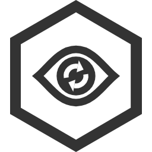

# syncwatch icon



## What it shows

- **An eye**: syncwatch watches the Syncthing servers, and only ever looks. It never changes them.
- **Two sync arrows in the iris**: what it watches is Syncthing keeping the NASes and PCs in step.
- **The IVAR hexagon** around it, with the same proportions, frame weight and ink as IVAR Studios' other tools
  (Ingest, Photo Culler, md-writer, SMP).

It's black and white on purpose, like the others, so it prints, works as a favicon and stays readable on light and
dark backgrounds (the white inside the hexagon carries it on a dark header or taskbar).

## Files

| File | Use |
|---|---|
| `syncwatch-icon.svg` | The master drawing. Edit this one; everything else is built from it. |
| `png/syncwatch-icon-<size>.png` | Square, transparent around the hexagon: 16, 24, 32, 48, 64, 128, 256, 512 and 1024 px. |
| `syncwatch-icon.ico` | Windows icon (16 to 256 px in one file), for a shortcut to the dashboard or the binary. |
| `export.go` | Builds the PNGs and the `.ico` from the SVG and copies the dashboard's files. |

The PNGs are square with the hexagon centred and as tall as the square (the hexagon is 0.866 times as wide as it is
tall), so they drop into any slot that expects a square icon.

The dashboard uses copies in `internal/web/assets/` (the SVG, the `.ico`, and the 32 and 256 px PNGs), embedded in
the binary.

## Using it

**Dashboard.** `layout.html` links the SVG as the favicon, the 32 px PNG as the fallback and the 256 px PNG as the
`apple-touch-icon`; `/favicon.ico` serves the `.ico` for browsers that ask for it directly. The header shows the SVG
next to the name.

**Discord.** Webhook messages have no avatar of their own, so they show the webhook's. Give it the icon in Discord:
Channel → Integrations → Webhooks → the syncwatch webhook → upload `png/syncwatch-icon-256.png`.

**Anywhere else** (README, docs, slides): use a PNG of the size you need, or the SVG.

## Drawing

All sizes are in the SVG's own units: `viewBox="0 0 173.2 200"`. Angles are clockwise from 12 o'clock.

| Part | Specification |
|---|---|
| Hexagon | The same as the other IVAR tools: regular, pointed at the top and bottom, circumradius 100 (173.2 wide × 200 tall), frame 14.1 thick. |
| Colours | Ink `#333333` and white `#ffffff`. Nothing else. |
| Eye | An almond drawn as a 10 thick ink line with mitred corners, white inside. Its centre line runs from (36.6, 100) to (136.6, 100) and reaches 35 above and below the middle; each quarter is one cubic Bézier that leaves the corner at 40° and arrives level at the top or bottom. Outside, it is about 116 × 80. |
| Iris | A solid ink circle, radius 25.5, in the middle of the hexagon (86.6, 100), so a white gap of 4.5 separates it from the lids (the same gap as between Photo Culler's cards). |
| Arrows | Two white arcs, radius 13 and 6.5 thick, each 110° long, turning clockwise. Each ends in a triangular head 16 wide whose tip lies on the arc 40° further on. The first starts at 260°, the second 180° later, leaving 30° between a tip and the next tail. |
| Position | The eye is centred in the hexagon. |

## Building the PNGs and the .ico again

After changing `syncwatch-icon.svg`, run from the repository root:

```sh
go run docs/icon/export.go              # finds Edge, Chrome or Chromium
go run docs/icon/export.go -browser PATH
```

It renders every PNG with the browser headless on a transparent background, packs the 16 to 256 px ones into the
`.ico` (PNG-compressed entries, which Windows reads since Vista) and copies the dashboard's four files into
`internal/web/assets/`. Commit the results with the SVG.

## Rules for changes

- **Keep the hexagon exactly as it is.** It is the shared IVAR frame; only the drawing inside changes between tools.
- **Keep the icon in two colours.** For a light version on a dark background, swap ink and white as a whole; don't
  tint parts of it.
- **Small sizes:** below 32 px the arrows merge into the iris and the eye reads as an eye with a dark pupil. That is
  expected; don't add detail for the small sizes.
